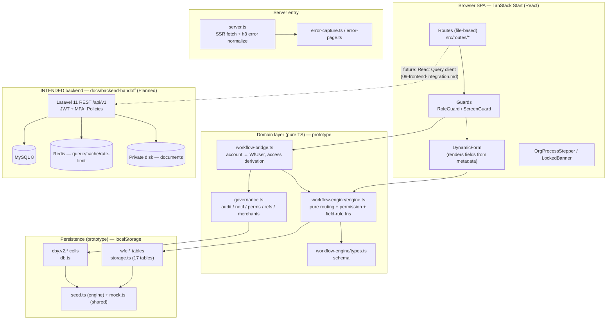

# 01 — Architecture

## Two-world architecture

The app is a **single-page TanStack Start (React, TS) frontend** that today runs
entirely against **browser localStorage** (no backend). The `docs/backend-handoff/`
package specifies the **real Laravel 11 backend** it is meant to bind to.

So the production target is a classic 3-tier app; the prototype simulates the data
tier in the browser.

---

## Layers

### 1. Presentation — `src/routes/*`, `src/components/*`
File-based routing. Pages are queue/role-scoped, never a shared admin dashboard.
Two guard components enforce visibility **at mount time** (role-forbidden surfaces
are not rendered):

- `RoleGuard` — allow-list of role ids; legacy/static (`RoleGuard.tsx:17`).
- `ScreenGuard` — derives access from the **workflow designer** for `requests`,
  and from the **screen-permission matrix** for other screens, re-evaluating
  reactively as assignments/perms change (`ScreenGuard.tsx:21-26`).

`DynamicForm` is the heart of the UI: it renders **whatever fields the active
version defines**, applying per-stage `visible/editable/required` rules — no field
is hard-coded.

### 2. Domain (pure TS) — the engine
`engine.ts` is a set of **pure functions that never touch the DOM and never throw on
missing data** (`engine.ts:8-12`). Categories:

- **Resolution**: `getDefinitionByCode`, `getPublishedVersion`, `getStagesForVersion`,
  `getInitialStage`, `getTransitionsFrom`.
- **Permission matching**: `canExecute`, `canView`, `isAssigned`,
  `canViewByStageRouting`, `matchAssignment` (`engine.ts:46-100`).
- **Field rules**: `getStageFields`, `getViewerFields`, `getFieldRules`
  (`engine.ts:245-281`).
- **Mutations**: `createInstance`, `saveDraftData`, `applyAction`, `cloneVersion`,
  `publishVersion` (`engine.ts:287-480`).

`applyAction` is the single transition gateway — every status change goes through it
(`engine.ts:361`). This mirrors the production rule "all transitions via
`WorkflowService::transition()`".

### 3. Bridge — `workflow-bridge.ts`
Reconciles two identity models: the legacy **account** (`User` in `mock.ts`) and the
engine **`WfUser`**. It synthesizes a `WfUser` from an account's org/team/role using
the same id-alias maps the designer uses (`workflow-bridge.ts:50-71`), then derives:

- **Requests-screen access** purely from designer assignments: assigned-to-initial →
  can create; assigned-to-any-execute → can act; assigned-to-any → can view
  (`workflow-bridge.ts:178-199`).
- **Org-scoped instance visibility** (`visibleInstancesFor`, `workflow-bridge.ts:97`).
- **Duplicate-invoice detection** (`isDuplicateInvoice`, `workflow-bridge.ts:227`).

### 4. Governance — `governance.ts`
Shared, non-lifecycle admin data, each a reactive `cell`:
audit log, notifications, merchants, entities, reference tables, orgs/teams/roles
catalogs, **role→permission** map (`can`, `governance.ts:328`), and the
**role×screen capability** matrix (`manualScreenCan`, `governance.ts:430`).

### 5. Persistence (prototype only)
Two namespaces, both reactive via `useSyncExternalStore`:

- `wfe:*` — 17 engine tables (`storage.ts:97-115`). Request lifecycle lives here
  **exclusively** (`governance.ts:15`).
- `cby.v2.*` — governance cells, with a **version-keyed reset**: bumping
  `CURRENT_VERSION` invalidates all seeds (`db.ts:6-49`).

### 6. SSR entry — `server.ts`
Wraps the TanStack server entry; converts catastrophic h3-swallowed SSR errors into a
branded 500 page (see [08 — Error Handling](08-error-handling-rules.md)).

---

## Intended production architecture (backend handoff)

From `00-api-and-auth.md:1-127` and `07-data-model.md`:

- **Stack**: Laravel 11 / PHP 8.2 / MySQL 8 / Redis. Swagger (l5-swagger), JWT
  (`php-open-source-saver/jwt-auth`).
- **API**: REST `/api/v1`, `application/json`, `snake_case`, ISO-8601 UTC dates,
  server-side pagination (`per_page` default 25, max 100). Every resource returns
  `id, created_at, updated_at, version`.
- **Runtime topology** (`00-api-and-auth.md:120-126`): Nginx + PHP-FPM; Supervisor for
  queue workers; Cron → Laravel Scheduler every minute; Redis for queue/cache/
  rate-limiting; **single production server with persistent storage**.
- **Files**: stored on a **private local disk outside `public`**; DB keeps only
  metadata + path; download only via authorized endpoint.

### Module → table grouping (`07-data-model.md:43-89`)

| Module | Tables |
|---|---|
| Governance | organizations, teams, roles, banks, users, screens, screen_permissions |
| Merchants | merchants, merchant_owners, merchant_companies |
| Workflow design | workflow_definitions, workflow_versions, workflow_stages, workflow_actions, workflow_transitions, stage_permissions, field_groups, field_definitions, stage_field_rules |
| Runtime | requests, request_documents, workflow_history |
| Platform | reference_tables, reference_values, audit_logs, notifications, notification_recipients, report_exports + JWT/queue tables |

### Key architectural decisions baked into the spec
1. **No parallel permission source.** `stage_permissions` is the single authority for
   request visibility/execution; the prototype's `StageRoutingRule` is explicitly
   removed (`03-workflow-designer.md:97`). `display_label` carries the contextual
   per-audience label instead.
2. **Queue is derived, not stored.** No `tasks` table in phase 1; the queue is a query
   over `current_stage_id` + `stage_permissions` (`04-requests-and-queue.md:52`).
3. **Dynamic data in JSON + explicit shadow columns.** `requests.data` is a JSON
   column, but bank/merchant/status/stage/reference/amount/currency/invoice_number get
   **real columns + indexes** so reports never scan unindexed JSON
   (`07-data-model.md:116-137`).
4. **Backend is final authority** on auth, permissions, validation
   (`README.md:10`).
