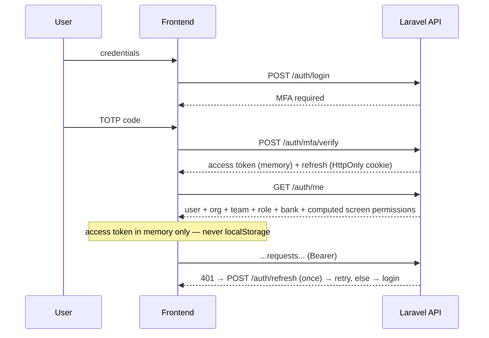
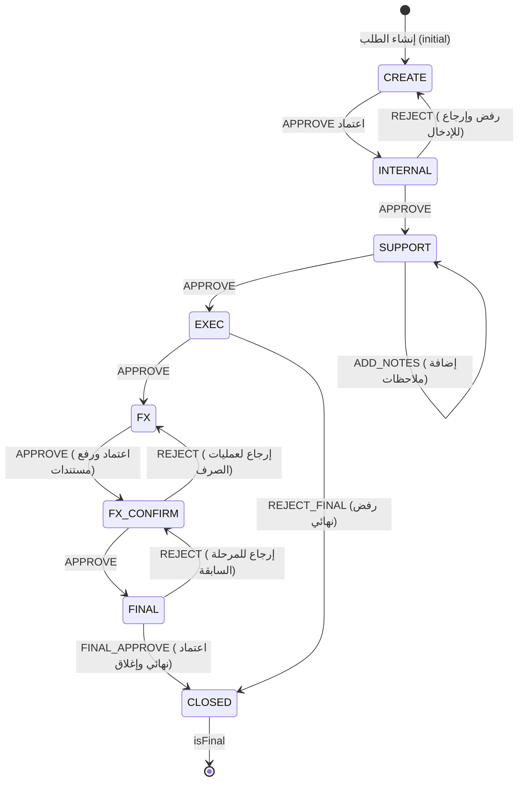
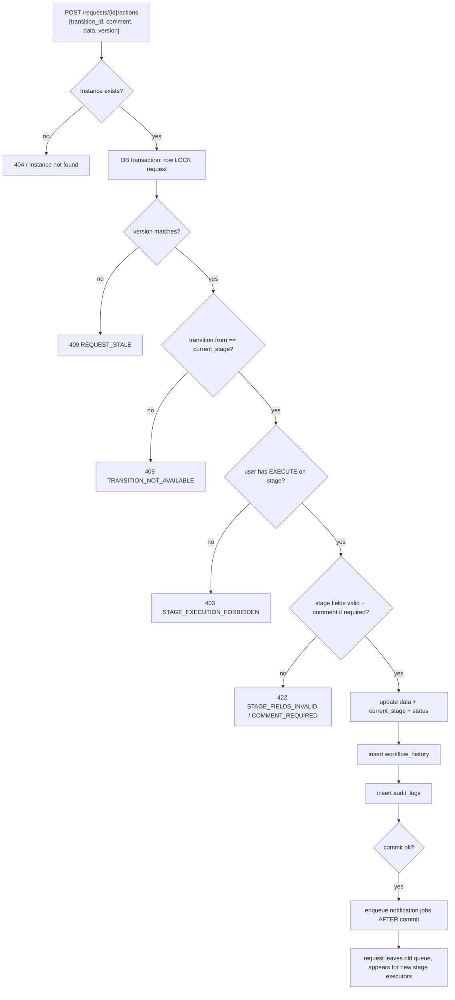
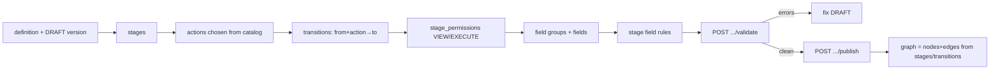

# 02 — Application Flow

Covers: identity flow, the request lifecycle (the seeded Import Financing workflow),
the queue, and the workflow designer build flow.

---

## A. Identity / session flow

Prototype: an identity switch via `RoleSwitcher` sets the engine "current user"
(`wfAuth.setId`, `wfAuth.ts:22`) and the legacy `auth` (`mock.ts:177`). The bridge
keeps them in sync (`syncWorkflowUser`, `workflow-bridge.ts:89`).

Production (`00-api-and-auth.md:67-101`):

Rules: short-lived access token in `Authorization: Bearer`; long-lived refresh in
`HttpOnly Secure SameSite` cookie; blacklist on; logout invalidates the session;
**disabling a user or changing sensitive permissions invalidates all their sessions**
(`00-api-and-auth.md:84-89`). Rate-limit login/MFA/reset.

---

## B. Request lifecycle — the seeded Import Financing workflow

The default published workflow has **8 stages / 12 transitions** (`seed.ts:125-165`).
This is *one configured instance* of the dynamic engine — not hard-coded logic.

| Stage | code | Executor (assignment) | Org |
|---|---|---|---|
| إنشاء الطلب (initial) | CREATE | team_entry | bank |
| المراجعة الداخلية | INTERNAL | team_internal | bank |
| المراجعة المساندة | SUPPORT | team_support | committee |
| القرار التنفيذي | EXEC | role_exec_lead (members view-only) | committee |
| عمليات الصرف | FX | team_fx | bank |
| تأكيد الصرف | FX_CONFIRM | team_fx_confirm | committee |
| الاعتماد النهائي | FINAL | role_exec_lead | committee |
| مغلق (final) | CLOSED | — | committee |

Assignments and view-only flag: `seed.ts:168-178`. Note EXEC members are
`viewOnly: true` — they see but cannot act; only the lead executes.

### Status vs stage
A request carries both `status` (`active|closed|rejected`) and `current_stage_id`.
Reaching an `isFinal` stage sets `status=closed` (`engine.ts:379`). Rejection paths
move to CLOSED but the seed marks them `rejected` (`seed.ts:412-419`).

---

## C. Execute-an-action flow (`applyAction`)

Prototype (`engine.ts:361-398`) and production (`04-requests-and-queue.md:60-83`)
agree on the ordered, transactional pipeline:

**Prototype gap vs spec:** the prototype's `applyAction` does **not** yet implement
the `version` optimistic-lock check, the comment-required check, or per-stage field
validation — those are spec-only (`04-requests-and-queue.md:71-81`). The prototype
does enforce: instance exists, transition exists, transition applies to current stage,
and `canExecute` (`engine.ts:362-371`).

### Create flow
- Allowed only if the user has `EXECUTE` on the **initial** stage
  (`workflow-bridge.ts:197`, `04-requests-and-queue.md:21`).
- Backend generates a unique `reference`; prototype generates
  `IMP-{year}-{seq}` (`engine.ts:323-331`).
- Creation writes the **first** `workflow_history` + `audit_logs` row
  (`engine.ts:307-319`, `04-requests-and-queue.md:24`).

### Draft save
Independent operation; does **not** leave the stage (`PATCH /requests/{id}/draft`,
`04-requests-and-queue.md:86-91`; prototype `saveDraftData`, `engine.ts:333`).
Validates editable fields; required fields enforced only on the leaving action.

---

## D. The queue — "طابور دوري"

`GET /requests/my-queue` returns only requests where: `status=ACTIVE`, the current
stage grants the user `EXECUTE`, and org/team/role/user/bank scope matches
(`04-requests-and-queue.md:44-58`). **Derived, not a stored task list.**

Default ordering: (1) SLA-breached, (2) closest to SLA breach, (3) oldest in stage.

After a transition the request **leaves the previous executor's queue** and appears
for the next stage's executors (`04-requests-and-queue.md:83`). Frontend must
invalidate details + list + my-queue + notifications + dashboard after an action
(`09-frontend-integration.md:52`).

---

## E. Workflow designer build flow

An admin builds a version in a strict internal order before it can be published
(`08-delivery-plan.md:56-66`):

Editing is only allowed on `DRAFT`; publishing is final; later edits start by
**cloning** a new version (`03-workflow-designer.md:14-16`). A request keeps its
original version until completion; **no migration between versions in phase 1**
(`03-workflow-designer.md:18-19`). `cloneVersion` deep-copies stages, transitions,
fields, rules, assignments with fresh ids (`engine.ts:410-469`).

Pre-publish validation rejects: bad/missing initial stage, no final stage, a
non-final stage with no transition, a non-final stage with no executor, transitions
to invalid resources, duplicate codes/keys, invalid field source
(`03-workflow-designer.md:158-168`).
