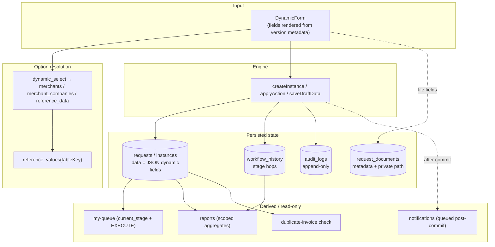

# 03 — Data Flow

How data is produced, transformed, persisted, and read across the system.

---

## End-to-end data flow



---

## 1. Field value lifecycle

A request's non-file values live in a single JSON bag, `instance.data`
(`types.ts:198`). Field **definitions** describe shape; **rules** describe per-stage
visibility/edit; **values** are keyed by `field.key`.

- On create, `data` is seeded with `requestIdentifier` then merged with input
  (`engine.ts:301`).
- Draft and action both shallow-merge new `data` over existing
  (`engine.ts:336`, `engine.ts:378`).

### Option sourcing
`select` fields carry static `options`. `dynamic_select` resolves at render time from
one of three sources (`types.ts:152`):

| `sourceTable` | Resolves from | Source |
|---|---|---|
| `merchants` | merchant list (bank-scoped) | `governance.ts:99` |
| `merchant_companies` | a merchant's linked companies | `mock.ts:212` |
| `reference_data` | `reference_values(referenceTableKey)` | `governance.ts:166` |

**Storage rule (production):** the request stores the **reference value id/key, not the
label** (`06-reference-permissions-notifications.md:32`, `07-data-model.md:120`). The
prototype currently stores labels in `data` — a divergence to fix when porting.

### Shadow columns for query
Although values live in JSON, the backend must mirror filterable/report fields into
**real indexed columns**: bank, merchant, status, stage, reference, amount, currency,
invoice_number (`07-data-model.md:120-122`). Reports must not scan unindexed JSON
(`07-data-model.md:124`). The bridge already reads several of these as typed accessors
(`instanceAmount`, `instanceCurrency`, `instanceRef`, `workflow-bridge.ts:114-137`).

---

## 2. Documents data flow

Files never live inside `requests.data`. Each document is its **own record** linked to
request + field + user + stage (`04-requests-and-queue.md:99`,
`03-workflow-designer.md:134`). Upload is `multipart/form-data`; the DB stores
metadata + private path only; download is via an authorized endpoint, never a public
URL (`00-api-and-auth.md:111-117`). Type/size/extension validated on the backend.
Deletion is logical + audited, allowed only before field lock / stage exit
(`04-requests-and-queue.md:97`, `07-data-model.md:114`).

---

## 3. Read / derive paths

| Read surface | Derived from | Scope applied |
|---|---|---|
| Requests list | instances where user has VIEW/EXECUTE on current stage | org + bank (`04-requests-and-queue.md:28`) |
| My-queue | ACTIVE + EXECUTE on current stage | org/team/role/user/bank (`04-requests-and-queue.md:44`) |
| History tab | `workflow_history` for the request, newest first | — (`engine.ts:400-404`) |
| Audit screen | `audit_logs`, filterable | user scope (`05-audit-and-reports.md:43`) |
| Reports | aggregates over requests + history | user scope + permission (`05-audit-and-reports.md:59`) |
| Progress bar | index of current stage / total non-final stages | — (`workflow-bridge.ts:139-144`) |
| Duplicate check | scan instances for same `invoiceNumber` created earlier | — (`workflow-bridge.ts:227-246`) |

Prototype visibility: `visibleInstancesFor` filters by
`canViewByStageRouting(currentStageId, wfUser)`; platform admin sees all
(`workflow-bridge.ts:97-103`).

---

## 4. Write transaction boundary

The mandated atomic unit for a transition (`04-requests-and-queue.md:70-81`):

```
BEGIN
  lock request row
  assert version, current stage, EXECUTE, fields, comment
  update request (data, stage, status)
  insert workflow_history
  insert audit_logs
COMMIT
→ enqueue notification jobs   (only after successful commit)
```

Three writes (`requests`, `workflow_history`, `audit_logs`) are committed together;
notifications are **side effects dispatched after commit** so a failed transaction
never emits a notification (`06-reference-permissions-notifications.md:134`).

Merchant create/update similarly accepts nested `owners` + `companies` inside one
transaction (`02-merchants.md:61`).

---

## 5. Concurrency / version propagation

Every editable record carries `version` (`00-api-and-auth.md:104`). Sensitive edits
send the current `version`; a mismatch returns `409 STALE_RESOURCE`
(`00-api-and-auth.md:106-107`). The same request cannot accept two transitions for the
same version (`00-api-and-auth.md:109`). The frontend re-sends `version` and, on
stale, reloads the resource (`09-frontend-integration.md:49-51`).

---

## 6. Seeding / reset data flow (prototype)

- Engine seed (`seed.ts:17-25`): if `wfe:seedVersion` mismatches or no definitions
  exist, wipe engine tables and reseed the Import Financing workflow + sample
  instances/history.
- Governance reset (`db.ts:41-49`): if `cby.v2.version` mismatches `CURRENT_VERSION`,
  clear all `cby.v2.*` keys.

These are prototype-only mechanisms; production replaces them with migrations + seeders
for **protected default data only** (not demo business data) (`README.md:40`,
`08-delivery-plan.md:126`).
