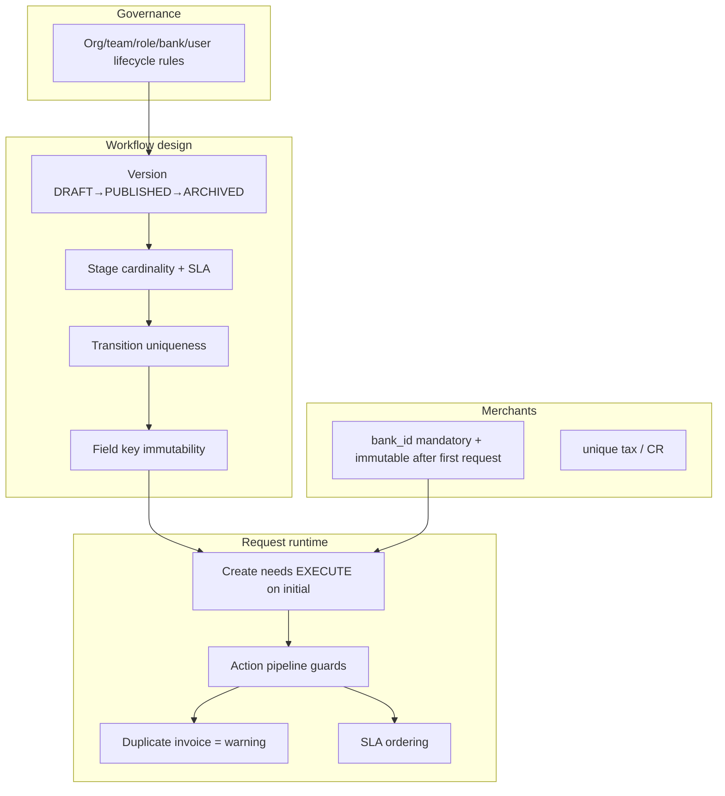

# 04 — Business Rules

The authoritative business rules, by domain. Sourced primarily from
`docs/backend-handoff/*` (the rule authority), cross-checked against the prototype
engine.

---

## 1. Governance lifecycle rules (`01-governance.md`, `07-data-model.md:108-114`)

**Organizations** — independent top level. Three protected defaults:
`commercial_banks`, `national_committee`, `system_administration`. A default org
cannot be deleted, cannot be deactivated while in use; only its display name may
change, `code` stays fixed (`01-governance.md:13-17`).

**Teams** — belong to exactly one org, never to a bank directly. A user belongs to one
team. **No `role_code` inside a team** (the prototype's `TEAM_ROLE` map is a prototype
convenience the spec removes). Cannot delete/disable a team that has users
(`01-governance.md:36-42`).

**Roles** — belong to one org; a user has exactly one role; the role must belong to the
user's org. Default roles protected; a role attached to a user cannot be
deleted/disabled. Screen permissions attach to the role (`01-governance.md:62-68`).

**Banks** — a resource under the `commercial_banks` org via `organization_id`. A bank
user links to one bank; a merchant belongs to one bank. Cannot delete/disable a bank
that has users/merchants/requests; cannot change a bank's org after use
(`01-governance.md:88-92`).

**Users** — always one org + one team + one role; **one bank iff org is
`commercial_banks`, else null** (`01-governance.md:114-126`). Team and role must belong
to the user's org. Users are never hard-deleted; disabling a user with active work
requires reassignment or closing the work, and **invalidates JWT sessions**
(`01-governance.md:127-130`).

---

## 2. Workflow design rules (`03-workflow-designer.md`)

**Versions**: edit only `DRAFT`; publishing is final; later changes require a clone; a
request keeps its original version to the end; new requests use the active published
version; **no cross-version migration in phase 1** (`03-workflow-designer.md:14-19`).

**Stages** (`03-workflow-designer.md:30-41`):
- Exactly **one initial** stage; **at least one final** stage.
- `code` unique within the version.
- A stage tied to a transition or request **cannot be deleted**.
- Every non-final stage needs **≥1 outgoing transition** and **≥1 executor** before
  publish.
- Stages carry `sla_duration_minutes`.

**Actions** (`03-workflow-designer.md:46-58`): central reusable catalog; `code` unique
and immutable; name editable; cannot delete/disable an action used in a transition;
`SAVE_DRAFT` is independent and need not change stage. Kinds:
`DRAFT|APPROVE|REJECT|RETURN|CLOSE|INFO|CUSTOM`.

**Transitions** (`03-workflow-designer.md:66-77`): cannot repeat the same action from
the same stage (`unique(from_stage_id, action_id)`); self-transitions allowed;
`requires_comment` and `confirmation_message` are per-transition; execution validates
current stage + permission + stage fields, all in one transaction.

**Fields** (`03-workflow-designer.md:104-134`): 9 types
(`TEXT/NUMBER/DATE/SELECT/DYNAMIC_SELECT/TEXTAREA/FILE/CURRENCY/CHECKBOX`); rich config
(min/max, length, regex, options, reference table, dynamic source, file constraints).
`key` unique within version and **immutable once the version is used**; default fields
protected from deletion; a field used by a request is never deleted — it hides or
changes via a new version; files are separate records.

**Stage field rules** (`03-workflow-designer.md:138-146`): per stage×field
`is_visible/is_editable/is_required`; backend re-checks on draft save **and** on
transition.

**Validation before publish** (`03-workflow-designer.md:158-168`) and **publish
rejects any error** (`:168`).

---

## 3. Request runtime rules (`04-requests-and-queue.md`)

- **Create**: requires `EXECUTE` on the initial stage; bank + merchant come from the
  user's authorized scope; data validated against initial-stage field rules; first
  history + audit rows written (`:21-24`).
- **List visibility**: only requests whose **current** stage grants VIEW/EXECUTE, with
  org + bank scope (`:28`).
- **Queue**: ACTIVE + EXECUTE on current stage + identity match (`:44-50`).
- **Action pipeline**: lock → version → stage → EXECUTE → fields/comment → update →
  history → audit → queued notifications (`:70-83`).
- **Draft**: only EXECUTE holders on the current stage; validates editable fields;
  required only enforced on the leaving action (`:88-91`).
- **Documents**: per request+field+user+stage; deletable before lock/stage exit
  (`:95-99`).

### Duplicate invoice (compliance, NOT a hard block)
Backend checks invoice-number reuse; the result is a **compliance warning, not an
automatic block**, unless a business rule is added later
(`04-requests-and-queue.md:108-110`, `05-audit-and-reports.md:50`).
Prototype implements this as: same `invoiceNumber`, on an **earlier-created** instance,
returns `{duplicate, refs[]}` (`workflow-bridge.ts:227-246`).

### SLA
Phase-1 compliance surfaces SLA breach; queue ordering prioritizes breached →
near-breach → oldest (`04-requests-and-queue.md:54-58`, `05-audit-and-reports.md:54`).
SLA source is `stage.sla_duration_minutes`.

### Request business error codes
`REQUEST_STALE`, `TRANSITION_NOT_AVAILABLE`, `STAGE_EXECUTION_FORBIDDEN`,
`STAGE_FIELDS_INVALID`, `COMMENT_REQUIRED`, `REQUEST_CLOSED`, `MERCHANT_OUT_OF_SCOPE`
(`04-requests-and-queue.md:114-120`).

---

## 4. Merchant rules (`02-merchants.md`)

- `bank_id` mandatory (`:15`).
- **Tax number unique system-wide**; **CR number unique per linked company
  system-wide** (`:16-17`).
- Bank user sees/manages only **their bank's** merchants; a global-scope user sees all
  with a bank filter (`:18-19`).
- No hard delete — **soft delete** (`:20`).
- Cannot suspend a merchant with **active requests** (`:21`).
- **Cannot change the bank after the first request** (`:22`).
- Every edit is audited (`:23`).
- Owners carry `ownership_percentage` 0–100; UI shows ≥25% but the DB never enforces
  that threshold to avoid data loss (`:40`).
- Errors: `MERCHANT_TAX_NUMBER_EXISTS`, `COMMERCIAL_REGISTRATION_EXISTS`,
  `MERCHANT_HAS_ACTIVE_REQUESTS`, `MERCHANT_BANK_IMMUTABLE`, `MERCHANT_OUT_OF_SCOPE`
  (`:73-77`).

---

## 5. Reference-data rules (`06-reference-permissions-notifications.md:5-36`)

Keys fixed + unique; the request stores the value id/key not the label; a table used by
a published version is not deleted; a value used by a request is not deleted; disabling
prevents new selection but preserves history; defaults protected from deletion.

---

## 6. Reporting / privacy rules (`05-audit-and-reports.md:59-97`)

Every report applies user scope + permission. Default reports show **team/role**
performance; **individual-performance reports require a separate permission**. No data
is returned outside the user's bank/org. Large exports run as queued jobs using the
same filters as the on-screen view.

---

## Out of phase-1 scope (`README.md:48-54`)
Multiple teams/roles per user; cross-version request migration; saved custom reports;
SMS/email as real channels; distributed file storage; multi-server deployment.
