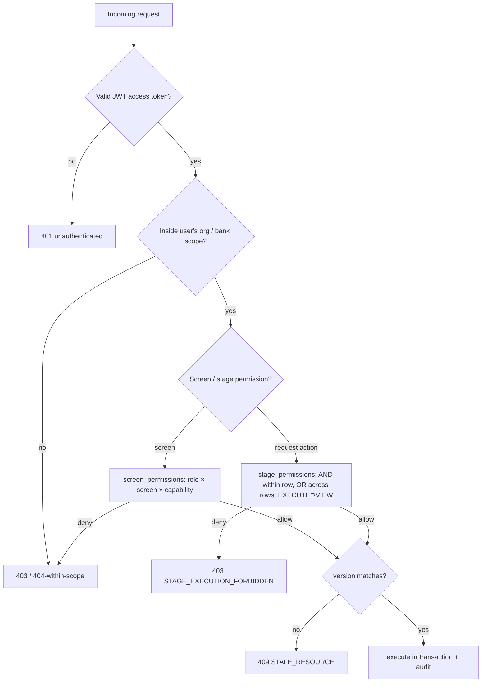

# 05 — Security Rules

Authentication, authorization, scoping, concurrency, and file security.

---

## 1. Authentication (`00-api-and-auth.md:67-101`)

- **JWT** via `php-open-source-saver/jwt-auth`. Endpoints: `/auth/login`,
  `/auth/mfa/verify`, `/auth/refresh`, `/auth/logout`, `/auth/me`,
  `/auth/forgot-password`, `/auth/reset-password`, `/auth/change-password`.
- **Access token**: short-lived, sent as `Authorization: Bearer`.
- **Refresh token**: longer-lived, in an **`HttpOnly Secure SameSite` cookie** —
  JavaScript must not read it (`09-frontend-integration.md:43-45`).
- **Never** put access or refresh tokens in `localStorage` (`00-api-and-auth.md:89`).
  Access token lives **in memory only** on the client.
- **MFA**: TOTP in phase 1, mandatory step after login.
- Blacklist enabled; logout invalidates the current session.
- **Disabling a user or changing sensitive permissions invalidates all their
  sessions** (`00-api-and-auth.md:86`, `01-governance.md:130`).
- **Rate limits** on login, MFA, and password reset (`00-api-and-auth.md:87`).

The production app (Yemen Flow Hub) already adds: 5 login attempts/min/IP, lockout
after 10 failures for 15 min — keep those at least as strict.

---

## 2. Authorization model

Three distinct gates — do not collapse them:

### a) Stage permissions (request runtime) — the core authority
Unified table `stage_permissions` (`03-workflow-designer.md:80-97`):

| Column | Role |
|---|---|
| stage_id | which stage |
| organization_id / team_id / role_id / user_id | audience scope (any may be null) |
| access_level | `VIEW` or `EXECUTE` |
| display_label | contextual label per audience |

**Matching algorithm** (`03-workflow-designer.md:90-94`, prototype
`matchAssignment` `engine.ts:93-100`):
- Fields set **within a row** are ANDed (org AND team AND role AND user).
- **Different rows** are ORed.
- `EXECUTE` **includes** `VIEW`.
- `user_id` is for explicit exceptions.
- A row with no filters at all matches nobody in the prototype (`engine.ts:99`).

Derived consequences:
- **Create** ⇐ EXECUTE on the initial stage.
- **Act** ⇐ EXECUTE on the current stage.
- **See request screen** ⇐ VIEW or EXECUTE on any stage.
- **Queue** ⇐ ACTIVE + EXECUTE on current stage.

There is **no parallel permission source** — `StageRoutingRule` is removed; the
designer's `stage_permissions` mandate request access (`03-workflow-designer.md:96-97`).

### b) Screen permissions (non-request screens)
Central catalog of screens × capabilities `VIEW/CREATE/UPDATE/EXPORT/MANAGE` mapped to
roles via `screen_permissions` (`06-reference-permissions-notifications.md:51-77`).
Rules:
- Frontend/backend must **not** rely on hard-coded role codes to allow screens
  (`:83`). Replace the prototype's static `RoleGuard` with backend-driven permissions
  (`08-delivery-plan.md:113`).
- Requests view/execute permission is **derived** from `stage_permissions`, not from
  this matrix (`:84`).
- Default system admin holds **all** permissions (`:86`).
- **Cannot remove permission-management from the last active system admin** (`:87`).

Prototype counterparts: `manualScreenCan` for reports/audit/merchants
(`governance.ts:430`), `can(role, perm)` for action permissions
(`governance.ts:328`), and `canScreen` which routes `requests` to the designer-derived
access (`workflow-bridge.ts:214`).

### c) Data scope (always-on)
Org-scoped and bank-scoped visibility enforced **at the query level**
(`04-requests-and-queue.md:28`, `02-merchants.md:18`). A bank user only ever sees their
bank's merchants/requests; a committee user sees committee-stage requests; the platform
admin sees all but still needs assignments to act. Out-of-scope reads return 403, or
404 if the resource exists outside the user's scope (`00-api-and-auth.md:62`).

---

## 3. Concurrency / integrity (`00-api-and-auth.md:104-109`)

- Every editable record has `version`.
- Sensitive updates send the current `version`; mismatch → `409 STALE_RESOURCE`.
- A request transition runs **inside a DB transaction with a row lock**.
- The same request will not accept two transitions for the same `version`.

This is the production-grade replacement for any optimistic UI assumption; the
prototype does not yet enforce it (gap noted in [02](02-app-flow.md)).

---

## 4. File security (`00-api-and-auth.md:111-117`)

- Storage on a **private Laravel disk outside `public/`**.
- DB stores metadata + path only.
- Upload via `multipart/form-data`; **type, size, extension validated on the backend**.
- Download only via an **authorized endpoint**, never a public file link.
- Backups include MySQL + the files directory.

The production app already mandates PDF-only uploads + checksum — keep that.

---

## 5. HTTP authorization semantics (`00-api-and-auth.md:58-66`)

| Code | Meaning |
|---|---|
| 401 | not authenticated |
| 403 | lacks permission **or** outside data scope |
| 404 | resource not found **within the user's scope** |
| 409 | state / version conflict, or resource-in-use |
| 422 | validation |
| 429 | rate limit |

---

## 6. Client-side security posture (`09-frontend-integration.md`)

- Access token in memory; refresh cookie unreadable by JS.
- On refresh failure → redirect to login.
- **No automatic retry** on `401/403/409/422` (`:13`) — these are decisions, not
  transient errors.
- `/auth/me` hydrates the user + computed permissions at app boot (`:46`).
- Role-forbidden surfaces are **not mounted** (guards short-circuit before render,
  `ScreenGuard.tsx`, `RoleGuard.tsx`) — never render then reject server-side.
