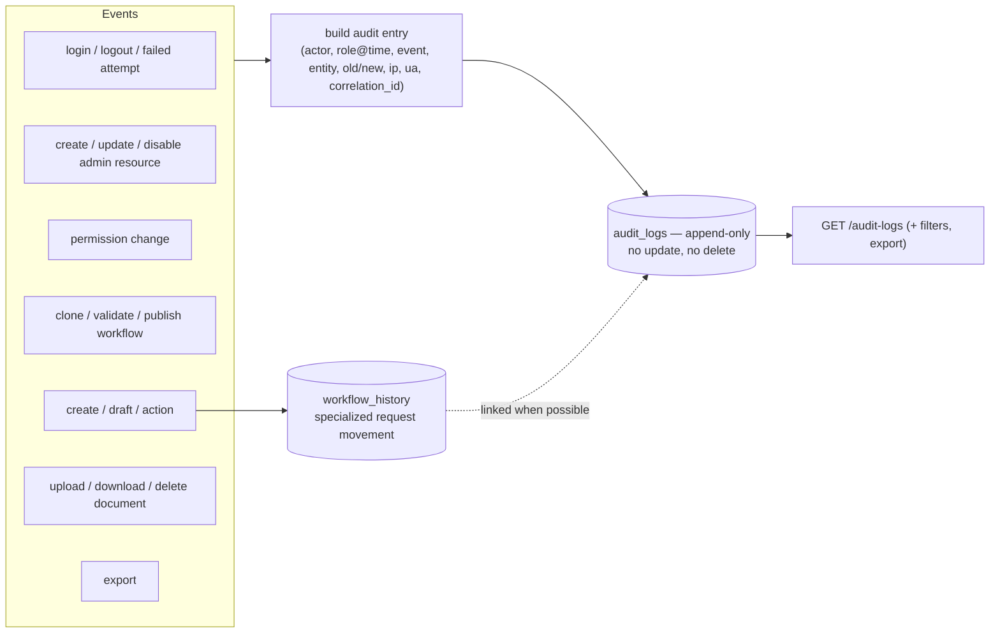

# 06 — Audit Rules

Source of truth: `05-audit-and-reports.md`. Prototype shape: `governance.ts:18-59`.

---

## 1. `audit_logs` is append-only

The table is **append-only and not editable or deletable from the application**
(`05-audit-and-reports.md:5`). Used records are never hard-deleted system-wide
(`README.md:13`). This is a hard invariant — no update path, no delete path, ever.

## 2. Required fields (`05-audit-and-reports.md:9-22`)

| Field | Notes |
|---|---|
| `actor_user_id` | who acted; `NULL` for unauthenticated attempts |
| `actor_role_id` | **role at the time of the action** (snapshot, not current) |
| `event_code` | the event identifier |
| `entity_type`, `entity_id` | the affected resource |
| `request_id`, `workflow_instance_id` | when the event concerns a request |
| `old_values`, `new_values` | before/after for changes |
| `metadata` | extra context |
| `ip_address`, `user_agent` | origin |
| `correlation_id` | ties an event to one logical operation / request chain |
| `created_at` | timestamp |

The prototype's `AuditEntry` is the simplified analog (`id, userId, userName, role,
action, ts, ip, device, ref, fromStage?, toStage?, notes?`, `governance.ts:18-31`) and
`logAudit` auto-fills `id/ts/ip/device` (`governance.ts:48-59`). When porting, expand
to the full field set above — especially `actor_role_id` snapshot, `old/new_values`,
and `correlation_id`.

## 3. What must be audited (`05-audit-and-reports.md:24-33`)

- Authentication: **login, logout, and failed attempts**.
- Admin resource **create / update / disable**.
- **Permission changes.**
- Workflow **clone, validate, publish**.
- Request **create, draft save, action execution**.
- Document **upload, download, delete**.
- **Exports**.

General rule: **every sensitive write is logged** (`README.md:12`).

## 4. Relationship to `workflow_history`

`workflow_history` stays a **specialized log of a request's movement** (stage hops) and
**links to the audit log where possible** (`05-audit-and-reports.md:34`). They are not
redundant:

| | `workflow_history` | `audit_logs` |
|---|---|---|
| Scope | one request's stage path | all sensitive system events |
| Rows | one per hop / draft / create | one per sensitive write |
| Fields | from/to stage, action, actor, comment, ts | full forensic record (old/new, ip, ua, correlation) |
| Source | `types.ts:204`, written in `applyAction`/`createInstance` | `governance.ts`, written by every sensitive op |

A transition writes **both** within the same transaction
(`04-requests-and-queue.md:78-80`).

## 5. Audit APIs & filters (`05-audit-and-reports.md:36-45`)

- `GET /audit-logs`, `GET /audit-logs/{id}`, `GET /audit-logs/export`,
  `GET /compliance/duplicate-invoices`.
- Filters: user, role, event, entity, request, date, IP, correlation id.
- Audit-screen visibility is itself permission-gated (`audit` screen capability,
  `06-reference-permissions-notifications.md:64`).

## 6. Audit timing rules

- Creation/transition: audit row is written **inside** the same transaction as the
  state change (`04-requests-and-queue.md:78`).
- Export is itself an audited event (`05-audit-and-reports.md:33`).
- Failed auth is audited with `actor_user_id = NULL` (production app already does this;
  keep it).

## 7. Compliance signals derived from audit/data (`05-audit-and-reports.md:48-55`)

Phase 1 only: duplicate invoice detection, expired-document detection from recorded
data, SLA-breach display. **Advanced fraud indicators are not static data and are not
implemented without approved rules** (`:55`) — do not seed fake risk scores.
