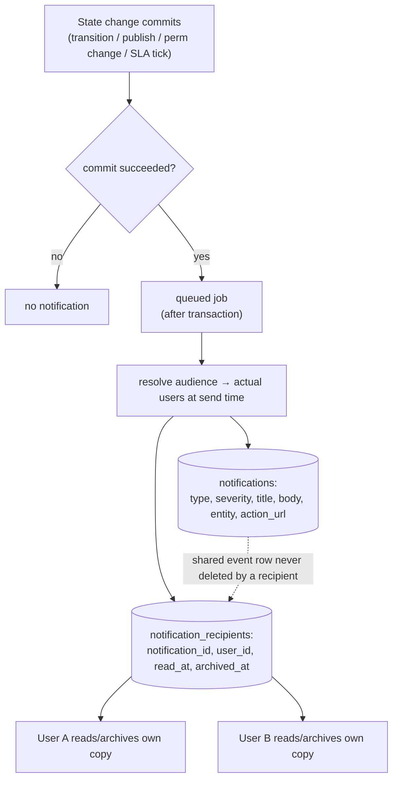

# 07 — Notification Rules

Source: `06-reference-permissions-notifications.md:96-144`. Prototype shape:
`governance.ts:61-97`.

---

## 1. Data model (`06-reference-permissions-notifications.md:98-114`)

Two tables:

**`notifications`** — the event + content (shared, single row per event):
`type`, `severity`, `title`, `body`, `entity_type`, `entity_id`, `action_url`,
`created_at`.

**`notification_recipients`** — the per-user delivery state (one row per user):
`notification_id`, `user_id`, `read_at`, `archived_at`. Unique
`(notification_id, user_id)` (`07-data-model.md:106`).

> Key shape: **one event, many recipient rows.** Read/archive state is per recipient,
> never on the shared event. The prototype flattens this into a single `Notif` cell
> with an `audience` and one `unread` flag (`governance.ts:61-74`) — expand to the
> two-table model when porting.

## 2. Trigger events (`06-reference-permissions-notifications.md:116-123`)

A notification is emitted when:
- a request **reaches an executable stage** (for that stage's executors);
- a request is **approved, rejected, or returned**;
- an SLA is **near or breached**;
- a **duplicate invoice / compliance** issue is detected;
- a **workflow version is published**;
- a **sensitive permission change** occurs.

## 3. Delivery rules (`06-reference-permissions-notifications.md:129-134`)

1. **Audience resolves to actual users at send time** — not stored statically. A
   "stage executors" audience is computed against `stage_permissions` when the job
   runs.
2. A user reads/archives **only their own copy**.
3. A recipient **cannot delete** a (shared) notification — only read/archive their row.
4. Creation is a **queued job dispatched after the transaction succeeds** — never
   inside the transaction, never on failure (`:134`, matches
   `04-requests-and-queue.md:81`).

## 4. Channels (`06-reference-permissions-notifications.md:125-127`)

**In-platform only** in phase 1. SMS and email as real channels are **out of scope**
(`README.md:51`). Do not build email/SMS dispatch yet; design the audience/recipient
layer so channels can be added later.

## 5. APIs (`06-reference-permissions-notifications.md:136-144`)

| Endpoint | Purpose |
|---|---|
| `GET /notifications` | list current user's notifications |
| `GET /notifications/unread-count` | header badge count |
| `POST /notifications/{id}/read` | mark one read |
| `POST /notifications/{id}/unread` | mark one unread |
| `POST /notifications/{id}/archive` | archive one |
| `POST /notifications/read-all` | mark all read |

Prototype equivalents: `notify`, `markAllRead`, `markNotifRead`, `deleteNotif`,
`clearAllNotifs` (`governance.ts:76-97`). Note the prototype allows delete — production
rule forbids a recipient deleting a shared notification, so port read/archive only.

## 6. Severity / type

The spec lists `type` + `severity` fields but does not enumerate the closed set;
the seed shows categories: new-request-needs-action, action-executed, duplicate-invoice
alert, request-closed, designer-version-published (`mock.ts:267-273`). When porting,
define an explicit `type` enum aligned to the trigger-event list in §2 and a
`severity` (e.g. info/warning/critical) used for icon/colour.

## 7. Frontend integration (`08-delivery-plan.md:116-119`)

Per-user notifications with read + archive; queue jobs for workflow + SLA events;
`/notifications` page and header counter wired; after any action, invalidate the
notifications query alongside details/list/queue/dashboard
(`09-frontend-integration.md:52`).
