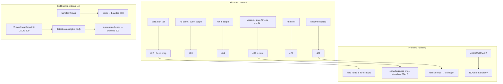

# 08 — Error Handling Rules

Two surfaces: **API error contract** (backend handoff) and **SSR/runtime error
handling** (prototype `server.ts`).



---

## 1. API error envelope (`00-api-and-auth.md:44-66`)

All errors share one shape:

```json
{
  "error": {
    "code": "ROLE_IN_USE",
    "message": "human readable (Arabic)",
    "fields": { "name": ["الاسم مطلوب"] },
    "request_id": "01J..."
  }
}
```

- `code` — machine-stable business/error code.
- `message` — localized human message.
- `fields` — only for `422`, maps field → messages.
- `request_id` — correlates with audit/log (`correlation_id`).

### HTTP code semantics

| Code | Trigger |
|---|---|
| 401 | unauthenticated |
| 403 | no permission **or** outside data scope |
| 404 | resource not found within the user's scope |
| 409 | state/version conflict **or** resource-in-use |
| 422 | validation |
| 429 | rate limit |

## 2. Business error codes (closed, stable)

These are part of the contract — clients branch on `code`, not message:

**Requests** (`04-requests-and-queue.md:114-120`): `REQUEST_STALE`,
`TRANSITION_NOT_AVAILABLE`, `STAGE_EXECUTION_FORBIDDEN`, `STAGE_FIELDS_INVALID`,
`COMMENT_REQUIRED`, `REQUEST_CLOSED`, `MERCHANT_OUT_OF_SCOPE`.

**Merchants** (`02-merchants.md:73-77`): `MERCHANT_TAX_NUMBER_EXISTS`,
`COMMERCIAL_REGISTRATION_EXISTS`, `MERCHANT_HAS_ACTIVE_REQUESTS`,
`MERCHANT_BANK_IMMUTABLE`, `MERCHANT_OUT_OF_SCOPE`.

**Governance** example: `ROLE_IN_USE` (`00-api-and-auth.md:48`). Concurrency:
`STALE_RESOURCE` (`00-api-and-auth.md:107`).

> Production analog: the Yemen Flow Hub app already returns `WORKFLOW_IMMUTABLE_STATE`
> (403) for mutations on terminal states and `WORKFLOW_LOCKED_STATE` — these are the
> same class; align naming when porting (`REQUEST_CLOSED` ≈ immutable terminal).

## 3. Frontend error rules (`09-frontend-integration.md:13, 36-40, 49-51`)

- **No automatic retry** on `401/403/409/422` — they are decisions, not transient
  failures.
- `422` → map `fields` onto form inputs.
- `409` business error → show the business message; on `STALE_RESOURCE`, reload the
  resource then let the user retry.
- `401` → attempt refresh **once**; on failure go to login.
- **Never lose a draft on a network failure** (`:40`) — preserve unsent input.
- Every list needs: loading skeleton, empty state, **filtered**-empty state, API-error
  state with retry, pagination, and disabled mutation while submitting (`:26-33`).

## 4. SSR / runtime error handling (prototype, `server.ts`)

The TanStack Start server entry has two failure modes; both end in a **branded 500
page** (`error-page.ts`):

1. **Direct throw** in the handler → `try/catch` logs and returns the branded page
   (`server.ts:74-78`).
2. **h3-swallowed throw** — h3 turns an in-handler throw into a *normal* 200/500
   `Response` with body `{"unhandled":true,"message":"HTTPError"}`, so `try/catch`
   never fires (`server.ts:53-54`). `normalizeCatastrophicSsrResponse` inspects
   status ≥ 500 JSON bodies, matches that exact shape, logs the **real** captured
   error, and substitutes the branded page (`server.ts:55-67`).

The real error is recovered **out of band**: `error-capture.ts` listens for global
`error` / `unhandledrejection` and stashes the last error for 5 s, so `server.ts` can
log the true stack even after h3 discarded it (`error-capture.ts:11-27`).

> Production note: this is a frontend SSR concern, not a backend rule. In the Laravel
> backend, the equivalent is the standard exception handler rendering the §1 error
> envelope. The lesson to carry over: **catastrophic errors must still produce a
> branded, logged, user-safe response — never a raw framework error body.**

## 5. localStorage / quota errors (prototype)

Persistence writes swallow quota/private-mode failures silently (`db.ts:25-28`,
`storage.ts:54-57`) so the UI never crashes on storage failure. The production
equivalent is server-side persistence; this pattern does not port, but the principle
(degrade, don't crash, on a non-critical write) is worth keeping for client caches.
