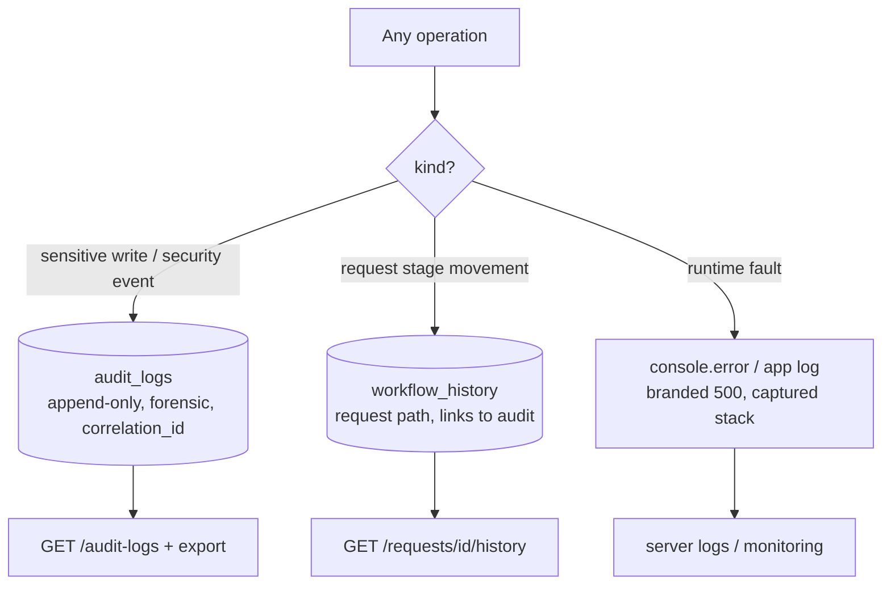

# 09 — Logging Rules

Logging in this system is **three distinct streams** with different purposes,
retention, and consumers. Do not conflate them.

---

## 1. The three streams

| Stream | Purpose | Mutable? | Where | Source |
|---|---|---|---|---|
| **Audit log** | Forensic record of *who did what* (security + compliance) | **No** (append-only) | `audit_logs` table | `05-audit-and-reports.md:5` |
| **Workflow history** | Domain record of a request's stage path | Append-only in practice | `workflow_history` table | `types.ts:204` |
| **Runtime/error log** | Technical faults for ops/debugging | n/a | `console.error` → server logs | `server.ts:65,76` |

Audit + history rules are detailed in [06 — Audit](06-audit-rules.md). This doc covers
the cross-cutting logging discipline.

## 2. Correlation (`05-audit-and-reports.md:22`, `00-api-and-auth.md:53`)

- Every audit entry carries a `correlation_id`.
- Every API error envelope returns a `request_id`.
- These should be the **same id** for one logical operation, so an error a user
  reports can be traced to its audit entry and server log line.
- The audit screen can filter by correlation id (`05-audit-and-reports.md:45`).

**Rule for porting:** generate one correlation/request id per inbound request
(middleware), attach it to the response, the audit row, and any error log line.

## 3. What goes to the audit log (security/compliance — not technical noise)

Only **sensitive writes and security events** (full list in
[06 §3](06-audit-rules.md)): auth (incl. failures), admin resource changes, permission
changes, workflow clone/validate/publish, request create/draft/action, document
upload/download/delete, exports. **Do not** dump read traffic or technical stack
traces into `audit_logs` — those belong in the runtime log.

## 4. What goes to the runtime/error log

- Caught handler exceptions (`server.ts:76`).
- Recovered h3-swallowed SSR errors, logged with the real stack
  (`server.ts:65`).
- Anything needed to debug a fault that is **not** a user-attributable business event.

Out-of-band capture exists so a swallowed error still reaches the log
(`error-capture.ts`).

## 5. Logging timing & integrity rules

1. Audit + history rows for a transition are written **inside the same transaction** as
   the state change (`04-requests-and-queue.md:78-80`) — they cannot drift from the
   actual state.
2. Audit log is **append-only**; no update, no delete from the app
   (`05-audit-and-reports.md:5`).
3. Failed authentication logs with `actor_user_id = NULL`
   (`05-audit-and-reports.md:25`; production app already does this).
4. `actor_role_id` records the **role at action time**, not the current role
   (`05-audit-and-reports.md:11`) — a snapshot, so later role changes don't rewrite
   history.
5. Notifications are **not** a log stream — they are dispatched after commit and are
   per-user delivery state, not an authoritative record.

## 6. PII / privacy in logs (`05-audit-and-reports.md:94-97`)

- Reports/exports never return data outside the user's bank/org scope; the same scope
  discipline applies to any log surface exposed in the UI.
- Individual-performance data is permission-gated — don't expose per-user metrics in a
  general log view.

## 7. Prototype reality vs production

The prototype's "logging" is just the reactive `auditCell` + `console.error`. There is
no structured app log, no correlation id, no `old/new_values`. When porting to Laravel:

- Use the framework logger (Monolog) for the runtime stream with the correlation id in
  context.
- Implement `audit_logs` as a real append-only table written by a dedicated
  audit service inside the transition transaction.
- Keep `workflow_history` distinct and linked.
