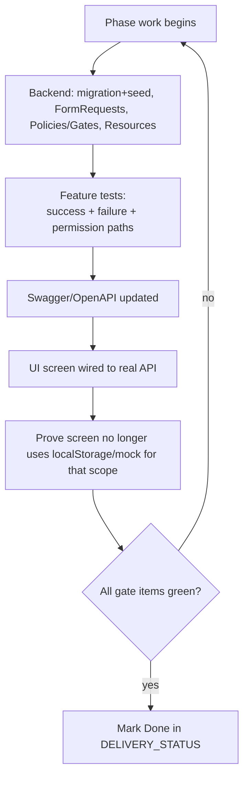

# 10 — Testing Rules

Source: `README.md:34-44`, `08-delivery-plan.md:121-129`. The system uses a
**stage-gate** model: nothing ships until its phase passes a fixed Definition of Done.

---

## 1. Definition of Done (per phase) (`README.md:34-44`)

A plan item is **not `Done`** until all of:

1. **Migration + seed** for protected default data.
2. **Form Requests** (validation) and **Policies or Gates** (authorization).
3. **Unified API Resources**.
4. **Feature tests** for **success, failure, and permission** cases.
5. **Swagger updated**.
6. The **corresponding UI screen wired**.
7. **Proof the screen no longer depends on `localStorage` or mock** for that phase's
   scope.

## 2. Test coverage requirements

Feature tests must cover **three path classes** explicitly (`README.md:41`):

| Path class | Examples to assert |
|---|---|
| **Success** | create request as initial-stage executor; transition by authorized executor; publish a valid version |
| **Failure** | stale `version` → 409; missing required field → 422; comment required → `COMMENT_REQUIRED`; publish invalid config → rejected |
| **Permission** | non-executor blocked from action (403 `STAGE_EXECUTION_FORBIDDEN`); out-of-scope merchant/request (403/404); last-admin permission removal blocked |

This maps directly onto the production app's existing pattern (org-scope guards,
terminal-state immutability tests, role-based 403 tests).

## 3. Phase gate checklist (`08-delivery-plan.md:121-129`)

Every phase gate requires:
- Updated OpenAPI.
- Passing feature tests.
- A working Postman/Swagger trial.
- **Minimal seed data — not demo business data.**
- No undocumented breaking change.
- UI wired and tested.
- Audit + permissions applied.

## 4. Workflow-designer acceptance tests (`08-delivery-plan.md:70-75`)

- No edits allowed on a published version.
- Clone produces an **independent draft**.
- Validate **explains each error**.
- Publish **rejects invalid configuration**.

These are the highest-value engine tests — they protect the core invariant that
published workflows are immutable and only valid configs go live.

## 5. Governance acceptance tests (examples, `08-delivery-plan.md:17-40`)

- Add a custom org; **block deleting a default**; **block disabling an org in use**.
- A team belongs to one org and **carries no fixed role**.
- **Block deleting/disabling a role in use**.
- **Block disabling a bank in use**.

## 6. Ordering / dependency rule (`08-delivery-plan.md:3`)

Phases ship in a fixed order; **a phase that depends on an earlier one does not start
wiring until the earlier contract is stable**. Tests therefore assume upstream
contracts are frozen — write them against the published OpenAPI, not against
in-flight schemas.

## 7. Prototype testing reality

The prototype has **no automated tests** in scope — it is a Lovable UX prototype. The
pure-function engine (`engine.ts`) is, however, **highly testable by design** (no DOM,
no throw, deterministic), which is the intended seam for the production unit/feature
tests. When porting, the engine's pure functions become the model for
`WorkflowService` unit tests, and the action pipeline becomes the basis for transition
feature tests.

## 8. Alignment with Yemen Flow Hub conventions

The production repo's AGENTS.md verification ladder already matches this philosophy:
focused tests first (smallest relevant filter), typecheck only on contract changes,
full suite only for release/broad/security changes. The reverse-engineered rule that is
**new**: enforce the **three-path (success/failure/permission)** coverage as a gate
condition for each ported phase, plus the **"prove no mock dependency"** check when a
screen graduates from prototype to real API.
