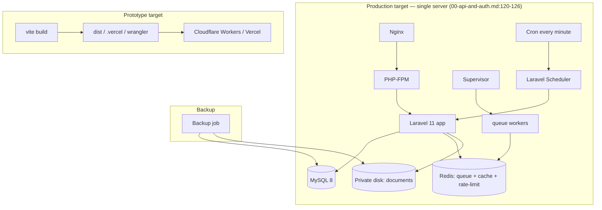

# 11 — Deployment Rules

Two deploy targets exist: the **prototype** (static SPA on Cloudflare/Vercel) and the
**intended production backend** (Laravel on a single server). The production rules are
the ones to honour.

---

## 1. Production topology (`00-api-and-auth.md:120-126`)

- **Nginx + PHP-FPM** serve the Laravel app.
- **Supervisor** keeps **queue workers** alive (notifications, exports run as jobs).
- **Cron** runs the **Laravel Scheduler every minute** (SLA checks, scheduled jobs).
- **Redis** backs **queue, cache, and rate limiting**.
- **One production server with persistent storage** — explicitly single-server in
  phase 1.

## 2. Storage & files (`00-api-and-auth.md:111-119`)

- Documents on a **private local disk outside `public/`**.
- DB stores file **metadata + path** only.
- **Backups include both MySQL and the files directory** (`:118`).
- **Distributed/object file storage is out of scope** in phase 1 — server disk only
  (`README.md:52`).

## 3. Async work that must be deployed as jobs

| Job | Trigger | Source |
|---|---|---|
| Notification dispatch | after a committed transition/publish/perm-change | `06-...:134` |
| SLA near/breach alerts | scheduler tick | `06-...:120`, `08-delivery-plan.md:117` |
| Large report exports | `POST /reports/exports` | `05-audit-and-reports.md:91` |

All require working Supervisor queue workers + Redis + the per-minute scheduler. The
failed-jobs table must be migrated (`07-data-model.md:88`).

## 4. Required infrastructure tables/services

- JWT blacklist/cache tables per the package config (`07-data-model.md:87`).
- Laravel queue `failed_jobs` + operational tables (`07-data-model.md:88`).
- Redis instance reachable by app + workers.

## 5. Config / contract deploy discipline

- **OpenAPI is the official API contract**; it is completed phase by phase and must be
  current at each gate (`README.md:7`, `08-delivery-plan.md:123`).
- **Published workflow versions are immutable** — deployments must never mutate a
  published version's config; new behaviour ships as a new version
  (`README.md:14`).
- **No undocumented breaking change** may ship (`08-delivery-plan.md:128`).
- Seed only **protected default data** in production, never demo business data
  (`08-delivery-plan.md:126`).

## 6. Out-of-scope for phase-1 deployment (`README.md:48-54`)

- Multi-server distribution of the app.
- Distributed file storage.
- SMS/email channel infrastructure.

## 7. Prototype build/deploy (informational)

The prototype builds with Vite (`vite.config.ts`) and ships as static assets; configs
present: `wrangler.jsonc` (Cloudflare Workers), `.vercel/`, `dist/`. It uses Bun
locally (`bun.lock`, `bunfig.toml`). **None of this is the production target** — the
production app is the Yemen Flow Hub Laravel + Nuxt stack, which uses `pnpm` and its own
deployment. Do not carry Bun/Wrangler into the production repo.

## 8. Mapping to Yemen Flow Hub

The production app is already Laravel 11 + MySQL + Redis + Nuxt 4 — it matches this
target stack. The deployment rules to **adopt** that may be new:

- Per-minute **scheduler** for SLA alerting (if not already running).
- **Supervisor** workers sized for notification + export job volume.
- Backups that explicitly include the **private documents disk**, not just the DB.
- A hard CI/deploy guard that **published workflow versions are never mutated** once the
  dynamic engine is live.
