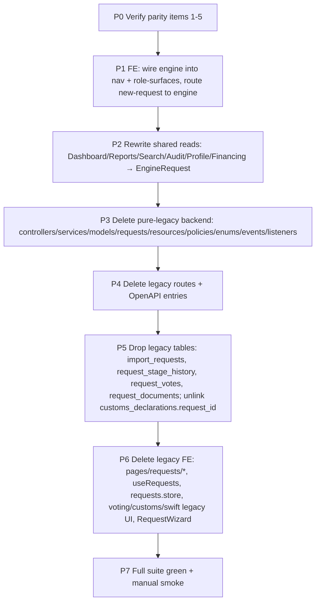

# 13 — G11 Cutover Plan: Remove Legacy, Engine-Only

**Decision (user, 2026-06-30):** Clean cutover **with legacy removal**. Dev environment,
existing `import_requests` are throwaway test data — **no backfill/migration**. The
dynamic engine becomes the only request system; the legacy fixed-workflow stack is
deleted.

> This is a large, destructive, backend+frontend+DB refactor. **65 backend files**
> reference `ImportRequest`. Execute in sequenced phases with a green test gate per
> phase — never one big delete.

---

## Ground truth (verified 2026-06-30)

| Fact | Evidence |
|---|---|
| Legacy is the only live request path | nav `/requests`, `WorkflowController` 25 endpoints, `useRequests`→`POST /api/requests` |
| Engine backend is complete & clean of legacy | `EngineTransitionService`, `StageHookRegistry` reference zero legacy models |
| Engine domain effects already run | `FinancingLedgerEffect` + `CustomsFxPdfEffect` wired in `AppServiceProvider` (EXEC, FX_CONFIRM hooks) |
| `customs_declarations` is **shared** (dual FK) | `CustomsDeclaration.php:12,39,44` — `request_id`→ImportRequest + `engine_request_id`→EngineRequest |
| Engine pages exist but orphaned | `pages/workflows/*` not in `AppSidebar`, not in role-surface matrix |
| Voting is pure-legacy | engine path has no voting (matches DI-3 "voting removed") |

### Classification of the 65-file blast radius

**A. Pure-legacy → DELETE**
`ImportRequestController`, `WorkflowController`, `VotingController`, `CustomsController`
(V1 legacy), `DocumentTemplateController`; `WorkflowService`, `VotingService`,
`Customs/CustomsService` + `CustomsDeclarationGenerator`, `Services/Voting/*`,
`Services/Workflow/TransitionMap`, `DuplicateDetectionService` (legacy; engine has
`DuplicateInvoiceChecker`); `FinancingLedgerService` (legacy; engine has
`FinancingLedgerEffect`); models `ImportRequest`, `RequestStageHistory`, `RequestVote`,
`RequestDocument`; requests `Store/UpdateImportRequest`, `UploadRequestDocumentRequest`;
resources `ImportRequest*Resource`; policies `ImportRequestPolicy`; enums
`RequestStatus`, `VoteType`, `VotingSessionStatus`, `WorkflowAction` (legacy fixed),
`AvatarVariant`(verify); events `RequestTransitioned`; listeners
`SendWorkflowNotifications`; legacy notifications (Submitted/Approved/Rejected/Returned/
SwiftUploadRequested/VotingOpened/CustomsIssued) **iff** engine has equivalents;
`ExpireClaimsCommand` (legacy support-claim) — verify engine claim model first.

**B. Shared read surfaces → REWRITE onto EngineRequest (not delete)**
`DashboardController` (42 refs), `ReportController` (20), `SearchController` (4),
`AuditController` / `AuditLogResource`, `ProfileController`, `FinancingController`,
`DocumentService`, `Bank`/`Merchant` model relations.

**C. Keep as-is**
`CustomsDeclaration` model (drop the `request_id`/ImportRequest relation, keep
`engine_request_id`); all `Workflow*Controller` designer controllers (engine);
`EngineRequest*` everything; `UserRole` enum (still the identity authority unless G-D
consolidation changes it — out of G11 scope).

---

## P0 parity result (verified 2026-06-30)

| # | Item | Status | Detail |
|---|---|---|---|
| 1 | Support-claim TTL | ⚠️ DECISION | Engine has **no** claim model; `ExpireClaimsCommand` is legacy-only. Engine stages are single-executor by design. **Decide:** drop the claim concept entirely, or port claim/heartbeat as an optional stage feature. |
| 2 | SWIFT upload | ✅ covered | Engine document CRUD (`engine-requests/*/documents`); SWIFT = FILE field + upload. |
| 3 | Notifications | ✅ covered | `EngineNotificationDispatcher`: transition, compliance.duplicate_invoice, sla.breached/nearing, workflow.published, permission.changed, with stage-executor audience resolution. |
| 4 | Customs PDF + signed upload | 🟡 verify upload path | `CustomsFxPdfEffect` generates the PDF via `CustomsDeclarationGenerator`. Signed-doc re-upload maps to engine document upload (#2) — confirm during P2/P3. |
| 5 | Report/dashboard shadow columns | ✅ covered | `engine_requests` indexes `status, amount, currency, invoice_number, bank_id, merchant_id, current_stage_id` + JSON `data`. |

**Classification fix from P0:** `CustomsDeclarationGenerator` is **shared** (used by
`CustomsFxPdfEffect`) → move to Class C (keep). Only the legacy `CustomsService`
orchestrator + `CustomsController` (V1) are Class A (delete).

**Only blocker:** item 1 (claim TTL) — a product decision, not missing infra.

## Open verification items (resolve at phase start, not now)

1. **Support-claim TTL** — does the engine have a claim model, or is `ExpireClaimsCommand`
   + Redis `support_claim:*` legacy-only? If the engine workflow needs claim/heartbeat
   on a stage, it must be ported as a stage feature before deleting.
2. **SWIFT upload** — legacy `swift-upload` endpoint. Engine equivalent =
   `engine-requests/*/documents` + a FILE field. Confirm parity before removing.
3. **Notifications** — confirm `EngineNotificationDispatcher` emits the equivalents of
   each legacy notification class before deleting them.
4. **Customs V1 vs engine** — `CustomsFxPdfEffect` already generates the FX/customs PDF
   on the engine. Confirm it fully replaces `Customs/CustomsService::generate` +
   `uploadSignedFxDoc` (signed-doc upload path).
5. **Reports/Dashboard fields** — confirm every column they read off `ImportRequest`
   exists as a shadow column on `engine_requests` (`RequestProjectionSync` populates
   bank/merchant/status/stage/amount/currency/invoice_number).

---

## Phased execution

### P0 — Parity verification (no deletion)
Resolve the 5 open items above. Any genuine gap (claim/swift/notification) becomes a
small pre-task: port that capability onto the engine **first**.

### P0.5 — Port stage-claim feature onto the engine (DECISION: keep claim)
Net-new engine feature; must exist before P3 deletes legacy claim code. Mirror legacy
semantics (`WorkflowController` claim methods + `ExpireClaimsCommand`):

- **Schema**: add `claimed_by` (FK users, nullable), `claimed_at`, `claim_expires_at`
  to `engine_requests` (mirror `2026_05_14_000007_add_support_claim_columns`).
- **Stage flag**: add `requires_claim` (bool) to `workflow_stages` — claim only applies
  to stages with a multi-user EXECUTE pool (e.g. support). Replaces the legacy
  status-based binding (BANK_REVIEW / SUPPORT_REVIEW_IN_PROGRESS).
- **TTL**: 15 min, config `workflow.support_claim_ttl_minutes` (reuse). Dual store: DB
  column + Cache key `engine_claim:{id}`.
- **Endpoints** (engine): `POST engine-requests/{id}/claim`,
  `POST engine-requests/{id}/claim/heartbeat`, `DELETE engine-requests/{id}/claim`.
  Claim = `lockForUpdate` + 409 if held by another + idempotent for same holder.
  Heartbeat = 403 if not holder, extends DB + cache. Release = holder or CBY_ADMIN.
- **Execution guard**: a `requires_claim` stage rejects `applyAction` unless the actor
  holds an unexpired claim.
- **Expiry**: rewrite `ExpireClaimsCommand` for `engine_requests` (scheduler every
  minute) — release claim on `engine_requests` whose `claim_expires_at < now()`,
  notify via the engine notification dispatcher.
- **Frontend**: claim/heartbeat(60s)/release wired into the engine instance page;
  "X is reviewing this" soft-lock banner.
- **Tests**: claim success / double-claim 409 / heartbeat-not-holder 403 / TTL expiry
  release / action-blocked-without-claim.

### P1 — Frontend cutover (engine becomes the live path)
- Add `/workflows` (queue) + `/workflows/new` + `/workflows/instances/[id]` to
  `AppSidebar`, `role-surfaces.ts`, `workflow.ts` surface matrix, `CommandPalette`,
  `SearchForm`.
- Repoint dashboards/wizard "new request" CTAs to the engine route.
- Keep `/requests` reachable but unlinked during P1–P5 (rollback safety), delete in P6.

### P2 — Rewrite shared read surfaces onto `EngineRequest`
Class-B files. Each: swap `ImportRequest::query()` → `EngineRequest::query()`, map
`RequestStatus` filters → engine stage/status, swap `ImportRequest*Resource` → engine
resources. Test each controller's feature tests green before moving on.

### P3 — Delete pure-legacy backend (Class A)
Delete in dependency order (leaves first): notifications/listeners/events → resources →
requests → controllers → services → policies → models → enums. Run `composer
format:check` + targeted tests after each cluster.

### P4 — Routes + contract
Remove legacy routes (`requests`, `workflow/*`, `voting/*`, legacy `customs`) from
`routes/api.php`; remove their `OpenApiSpec` entries.

### P5 — Database
Drop migrations are **new** migrations (don't edit history): drop `import_requests`,
`request_stage_history`, `request_votes`, `request_documents`; drop
`customs_declarations.request_id` FK + column (keep `engine_request_id`). Dev env → can
also `migrate:fresh` + reseed if cleaner.

### P6 — Delete legacy frontend
`pages/requests/**`, `useRequests`, `requests.store`, legacy voting/SWIFT/customs UI,
`RequestWizard` (if engine uses `DynamicForm`), legacy dashboard request widgets that
duplicated engine. Repoint any lingering `/requests` link to `/workflows`.

### P7 — Verify
Full backend `php artisan test` + frontend `pnpm test` green (release-grade change →
full suites justified). Manual smoke: create engine request → run full stage path →
customs PDF + financing ledger fire → reports/dashboard/search reflect it.

---

## Risks & mitigations

| Risk | Mitigation |
|---|---|
| Shared read surface silently loses data | P2 before P3/P5; feature tests per controller |
| A legacy domain feature has no engine equivalent | P0 gate — port first, delete after |
| Big-bang breakage | Phase gates; keep `/requests` unlinked until P6 for rollback |
| customs_declarations data loss | Only drop legacy FK; keep table + engine FK |
| Hidpaths (audit/notification) reference deleted models | grep-sweep each phase; `ImportRequest` ref count must hit 0 before P5 |

---

## Definition of done
- Zero `ImportRequest` / `RequestStatus` / legacy `WorkflowService` references in `app/`.
- New + existing flows run entirely on `engine_requests`.
- Customs PDF + financing ledger fire via engine hooks.
- Reports/dashboard/search/audit read engine data.
- Full suites green; legacy routes/pages gone.
